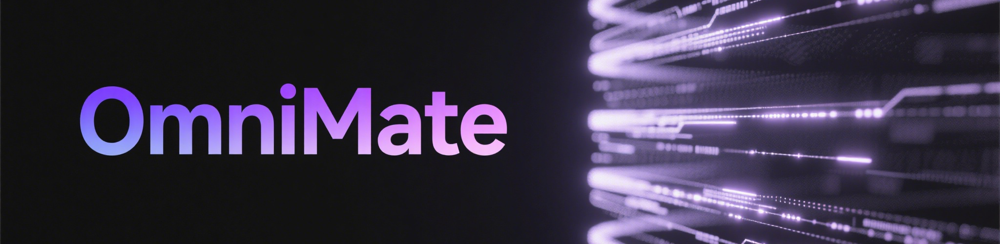

# OmniMate 🤖✨  
 [](https://opensource.org/licenses/MIT)  [](https://github.com/gaochao350/SeamlessHuman-Comp)[](https://github.com/YOUR_USERNAME/eamlessHuman-Comp?lang=zh)

<div align="center">
…  </h1>
</div>
  <hr style="height:2px; border-width:0; background: linear-gradient(90deg, rgba(46,134,193,0) 0%, rgba(46,134,193,0.6) 50%, rgba(46,134,193,0) 100%);">
</div> 

## 🌟 Revolutionize AI Agent Interaction
OmniMate is your intelligent companion that ​**sees**, ​**remembers**, and ​**understands**​ - bridging the gap between human intuition and machine intelligence. Imagine having a digital twin that evolves with your work patterns and anticipates your needs!


## OmniMate 技术说明 🚀

<div align="center">

### 🖥️ 实时感知层 | 秒/帧解析
​**参数**​  

​**技术**​  
```vLLM分布式部署``` ```多任务分叉推理```  
​**优势**​  
▸ 捕捉视觉/操作/文本三模式同步信号  
▸ 单帧生成细节描述+语义总结+偏好分析  

---

### 🧠 记忆处理层 | 三层存储结构
​**模型**​   
​**效能**​   
​**机制**​  
```原始细节``` & ```向量去冗余``` & ```图谱强化```  


---

### 🔄 决策输出层 | 动态适应引擎
​**压缩率**​   
​**架构**​ ```MCP记忆中心规划``` ```偏好图谱驱动```  
​**特征**​  
◈ 实时屏幕状态感知 + 历史记忆检索  
◈ 用户画像驱动的自适应响应生成  
​**案例**​  
▸ 根据GitHub操作历史自动优化仓库创建流程  
▸ 视频会议总结关联3天前设计稿修改记录
## 🚀 Core Architecture

<div align="center">

| 感知层              | 处理层              | 应用层              |
|---------------------|---------------------|---------------------|
| 屏幕动态捕捉         | 多级记忆存储         | 智能工作流           |
| 文本轨迹追踪         | 行为模式分析         | 跨场景关联           |
| 实时流处理           | 偏好预测系统         | 隐私守护机制         |


</div>
